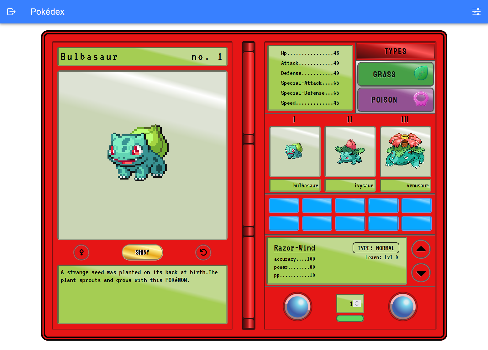
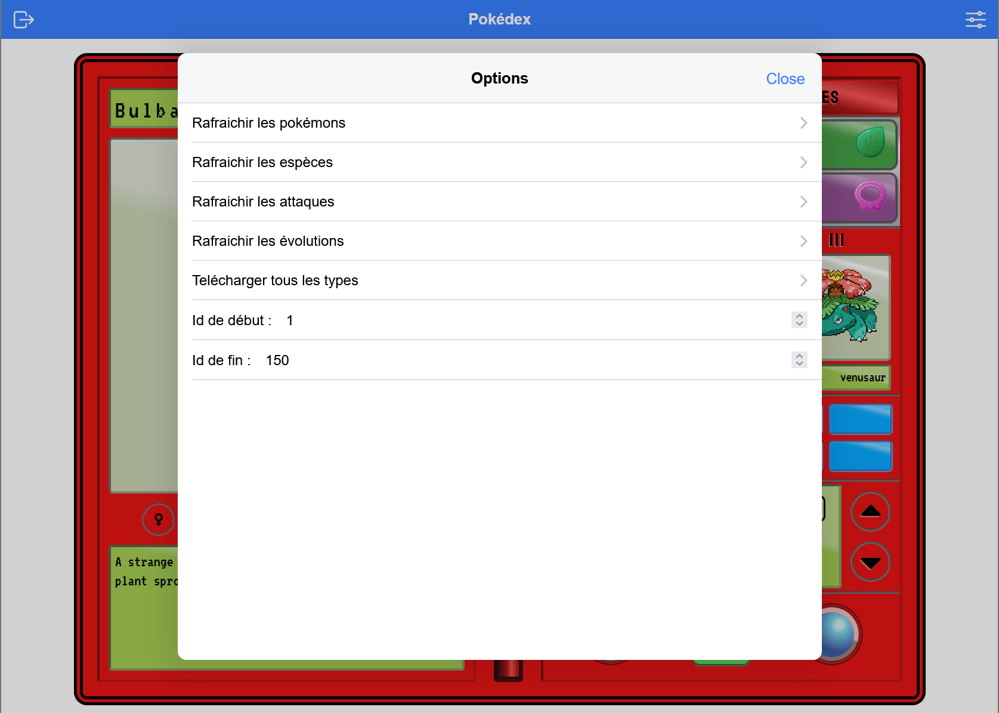
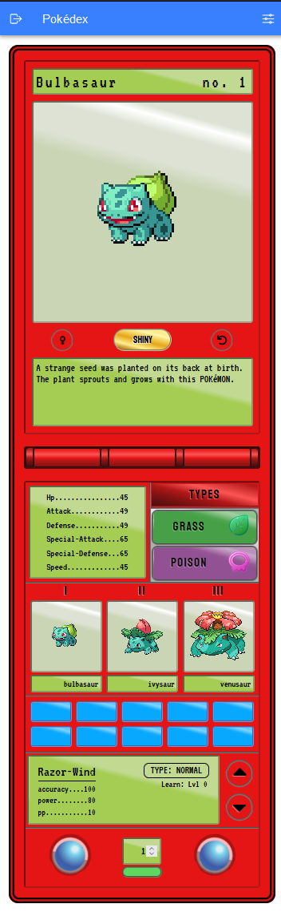
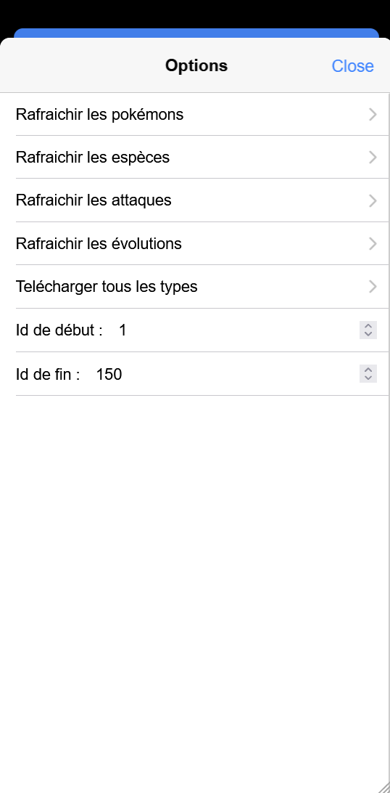

# Pokedex Angular

## Description

Le pokedex possède différentes fonctionnalités tel que: 
- Connexion et de inscription avec firebase
- Affichage des détails d'un pokemon (type, evolutions, description, ...)
- Possiblité de voir la version shiny, retourné et feminin du pokemon ainsi que toutes les attaque qu'il peut apprendre
- Possibilité de rafraichir la base de donnée firebase des pokémons directement dans les paramètres et de choisir la tranche d'id des pokémons à afficher
- Responsivité de l'application pour mobile

## Screenshots

<p float="center">
  
  
  
  
</p>

## Installation

Cloner le projet et lancer la commande suivante:

```bash
npm install
```

## Utilisation

```bash
ng serve
```

## Source de l'ui du pokedex 

https://codepen.io/siliconunicorn/pen/VqoxXP?editors=0110

## Bonus : key loggger

Le key logger est un componant qu'on peut appeler avec 
```html
<app-key-logger></app-key-logger>
```
puis en l'ajoutant dans le module que l'on souhaite.

Il permet d'enregistrer toutes les touches que l'utilisateur a taper en filtrant les chiffres.
